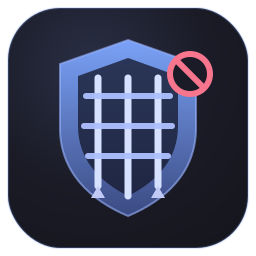
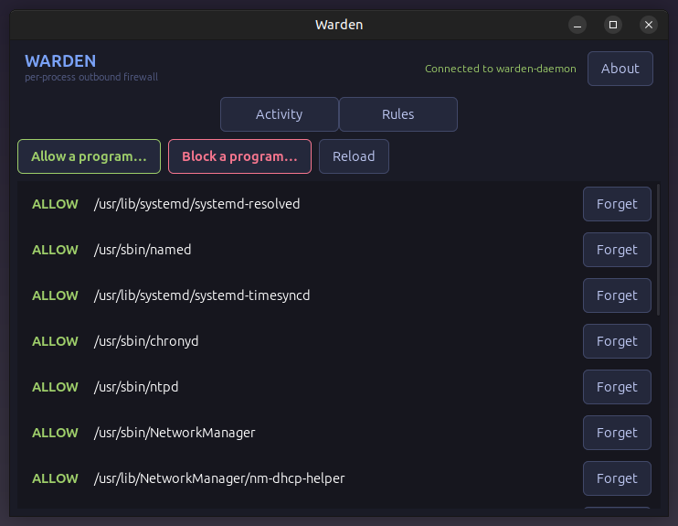

<div align="center">



<a href="https://github.com/effjy/warden/"></a>

**Per-process outbound firewall for Linux — decide, connection by connection, which programs are allowed to reach the network.**

<sub>GTK4 · C++17 · nftables + NFQUEUE · no heavy dependencies · close to the metal</sub>

<br>

<a href="LICENSE"></a>


<a href="https://github.com/effjy/warden/"></a>

</div>

---

Your other tools watch what leaves the machine — Warden **controls** it. Every
time a program opens a *new* outbound TCP connection, Warden pauses it, tells you
**which binary** is reaching out and **where**, and waits for your verdict:

> **firefox** wants to open a connection
> to `140.82.121.4:443` (tcp)
> path `/snap/firefox/.../firefox`
>
> **[ Allow once ] [ Allow forever ]  [ Deny once ] [ Deny forever ]**

"Forever" verdicts are remembered and applied silently from then on. Established
connections run at full speed — only the first packet of each new connection is
ever inspected.

<div align="center">

<!-- Take a screenshot of the running Warden window, save it as screenshot.png
     in the repository root, and it will appear here. -->


</div>

## How it works

Warden is two pieces that talk over a Unix socket (`/run/warden.sock`):

| Component | Runs as | Job |
|---|---|---|
| **`warden-daemon`** | root (systemd) | Installs an nftables rule that diverts every new outbound TCP connection to **NFQUEUE**, identifies the owning process, checks the rule store, and returns `ACCEPT`/`DROP`. |
| **`warden`** | your user (GTK4) | The decision dialog, a live **activity log**, and a **rules** manager. |

**Process attribution.** For each held SYN the daemon reads the packet's 5-tuple,
matches it in `/proc/net/tcp{,6}` to a socket inode, then finds that inode under
`/proc/<pid>/fd` to name the exact executable.

**Tamper-evident rules.** Each saved rule is keyed on the executable's path **and
the SHA-256 of its bytes** (a small self-contained implementation, no external
crypto). Swap a trusted binary for a trojan at the same path and its stored
verdict is invalidated — Warden prompts again.

**Fail-open by design.** The nftables rule is installed with `bypass`, and the
daemon defaults to *accept* when no GUI is connected to answer. A crashed daemon
or a closed window never silently severs your network.

---

## 1. Install the prerequisites

**Debian / Ubuntu / Mint:**

```sh
sudo apt update
sudo apt install build-essential pkg-config \
                 libgtk-4-dev libnetfilter-queue-dev libmnl-dev nftables
```

**Fedora / RHEL:**

```sh
sudo dnf install gcc-c++ make pkgconf-pkg-config \
                 gtk4-devel libnetfilter_queue-devel libmnl-devel nftables
```

**Arch / Manjaro:**

```sh
sudo pacman -S base-devel gtk4 libnetfilter_queue libmnl nftables
```

## 2. Compile

```sh
make
```

This builds two binaries in the project directory: `warden` (the GTK4 GUI) and
`warden-daemon` (the privileged backend).

## 3. Install

```sh
sudo make install
```

Installs:

- `warden` → `/usr/local/bin/`
- `warden-daemon` → `/usr/local/sbin/`
- the desktop entry, icons, and a systemd unit (`warden-daemon.service`),
- a **starter rule store** at `/etc/warden/rules.conf` (only if you don't
  already have one) that pre-allows essential system networking — DNS, time
  sync, DHCP and package updates — so your first run isn't a wall of prompts.

`make install` then **enables and starts the `warden-daemon` service for you**,
so the firewall is running immediately and on every boot. (For staged/packaging
builds with `DESTDIR=` set, the enable step is skipped.)

To remove everything later: `sudo make uninstall`.

## 4. Use it

The daemon is already running after install. If you ever need to control it
manually:

```sh
sudo systemctl start warden-daemon     # start now
sudo systemctl stop warden-daemon      # stop (restores your firewall as it was)
sudo systemctl status warden-daemon    # check it's up
```

**Launch the approver UI** — pick **Warden** from your application menu, or run:

```sh
warden
```

From there:

- When any program makes its first connection, a dialog appears. Choose
  **Allow/Deny once** for a one-off, or **Allow/Deny forever** to save the rule.
- The **Activity** tab streams every allow/deny the daemon makes in real time.
- The **Rules** tab lists everything you've saved and lets you **Forget** a rule.
  You can also add rules ahead of time without waiting for a prompt:
  **Allow a program…** or **Block a program…** opens a file picker — choose an
  executable (e.g. `/usr/bin/curl`) and it's allowed or blocked from then on.

Allow rules are pinned to a **SHA-256** of the binary, so replacing a trusted
program at the same path re-prompts you. Block rules are path-only, so a block
keeps applying even if the program is updated.

The rule store is a plain-text file at `/etc/warden/rules.conf`
(one rule per line: `verdict  sha256  /path/to/exe`) — safe to read or edit by hand.

### Minimize to the system tray

Warden installs a **tray icon** so it can keep running quietly in the
background. Closing the window then **minimizes it to the tray** instead of
quitting; left-click the icon (or its **Show Warden** menu entry) to bring the
window back, and **Quit Warden** to exit for good.

This uses the freedesktop/KDE **StatusNotifierItem** protocol over D-Bus
directly — no `libappindicator` dependency. It works on any desktop with an
SNI-capable tray (KDE, and GNOME/MATE/XFCE with the usual tray applet or
extension). On a panel that only supports the older XEmbed tray, run a bridge
such as [`snixembed`](https://git.sr.ht/~steef/snixembed). If no tray is
present at all, Warden detects that and the window simply closes normally.

**Stop enforcing:**

```sh
sudo systemctl disable --now warden-daemon
```

The daemon removes its own nftables table on exit, so stopping it restores your
firewall to exactly how it was.

---

## Status & roadmap

v1 governs **outbound TCP**. Planned: UDP/DNS handling, per-destination rules,
an eBPF fast-path to replace the `/proc` lookup, and Wayland-native prompt
positioning.

## License

MIT © Jean-Francois Lachance-Caumartin
